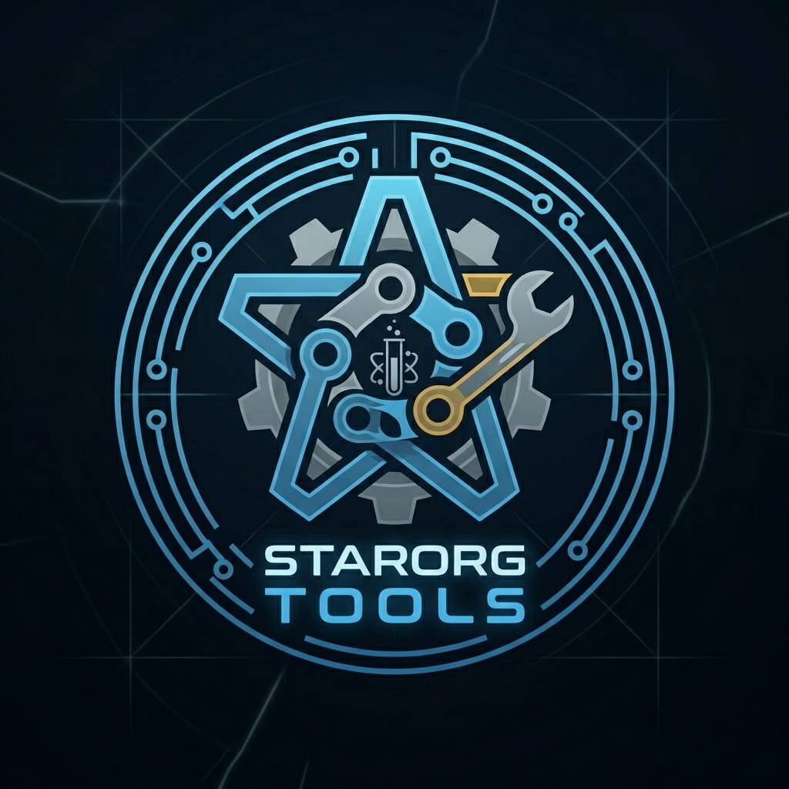

# Star Org Labs

**Run your Star Citizen org like a pro — from Discord to a full web command center.**

Events, fleet, loot, mining, recruitment, and org ops in one place. Your members
sign up in Discord; your leadership runs the show from the web.

<a href="https://starorg.tools"><b>🌐 Open the app →</b></a> &nbsp;·&nbsp;
<a href="#-getting-started"><b>🚀 Get started</b></a> &nbsp;·&nbsp;
<a href="#-what-you-can-do"><b>✨ Features</b></a> &nbsp;·&nbsp;
<a href="#-need-a-hand"><b>💬 Community</b></a>

---

## Why Star Org Labs?

Running an org is a second job — scheduling ops, chasing signups, tracking who
actually showed, splitting loot fairly, keeping the fleet and treasury straight.
Star Org Labs pulls all of it into one connected system so you spend less time on
spreadsheets and more time flying.

- **Meet your members where they are** — signups, reminders, and pings happen right in **Discord**.
- **Command from the web** — a full portal at [starorg.tools](https://starorg.tools) for planning, rosters, and org management.
- **Built by org runners, for org runners** — the features exist because we needed them.

---

## ✨ What you can do

### 🎯 Events & Operations
Plan an op in minutes with a guided **event wizard**, let members **sign up** for
roles and ships, and reuse **templates** for your regular runs. Track **attendance
and reliability** over time, schedule **recurring events**, and settle the haul
fairly with the built-in **Loot Hub**.

### 🚀 Fleet & Hangar
Give every member a **Personal Hangar** to register their ships, and give
leadership an **Org Fleet Dashboard** to see what the org can field.

### 🛡️ Org Command
A home base for leadership: **member & server dashboards**, **personnel roster**,
**org structure**, a **recruitment hub**, **support tickets**, **org goals**,
**guild points**, and **treasury** — plus a **public website CMS** to show your org off.

### ⛏️ Industrial
Tools for the working fleet: **mining sessions**, a **cargo optimizer**, the
**RSIG decoder**, a **rock calculator**, and **work orders**.

### 🎨 Make it yours
Theme the whole portal to your manufacturer of choice — **Aegis, Drake, Origin,
RSI, MISC, and more** — or set an org-wide look for your members.

---

## 🚀 Getting Started

1. **Open the app** → [starorg.tools](https://starorg.tools) and **sign in with Discord**.
2. **Add the bot to your server** — use **"Add to Server"** in the app and pick your Discord.
3. **Set up your org** — drop in your logo, pick a theme, and configure your channels.
4. **Run your first op** — hit **Create Event**, build the roster, and share it. Your members sign up from Discord. 🎉

That's it — no installs, no spreadsheets.

---

## 📖 Documentation

More guides are landing here as we build them out:

- **Getting started** — setting up your org (coming soon)
- **Bot commands** — the full Discord command reference (coming soon)
- **Events & loot** — planning ops and splitting the haul (coming soon)

---

## 💬 Need a hand?

- 🌐 **App:** [starorg.tools](https://starorg.tools)
- 💬 **Community & support:** join the **Star Org Labs** Discord <!-- TODO: add invite link -->
- 🐛 **Found a bug or have an idea?** Let us know in the community.

---

Star Org Labs is a community-built tool and is not affiliated with Cloud Imperium Games or Roberts Space Industries. Star Citizen® is a trademark of Cloud Imperium Rights LLC.

